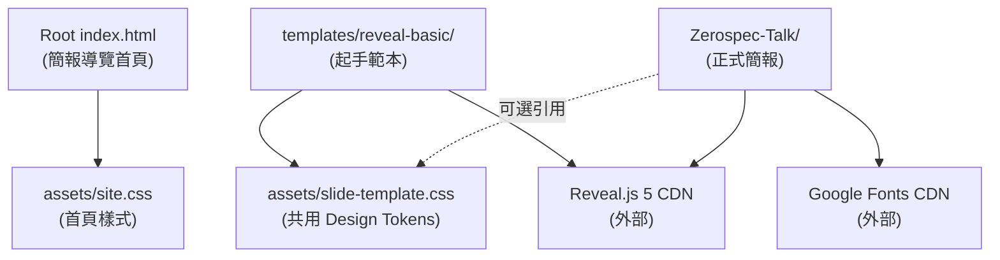

# SA-001: Slide-Html 系統架構分析

| 欄位 | 值 |
| --- | --- |
| Version | v0.1 |
| Snapshot Date | 2026-05-24 |
| Status | Active |

## 系統概觀

Slide-Html 是一個純靜態 HTML 技術簡報集中管理站，每份簡報是一個獨立資料夾，使用 Reveal.js 5 CDN 驅動投影片框架。不存在任何 build pipeline、套件管理或後端服務，可直接透過 GitHub Pages 發布。

## 技術棧

| 項目 | 版本 / 說明 |
| --- | --- |
| 簡報框架 | Reveal.js 5（CDN：`cdn.jsdelivr.net/npm/reveal.js@5/`） |
| 字型 | Google Fonts — Noto Sans TC 400/700（CDN） |
| 樣式 | 純 CSS Custom Properties（無 preprocessor） |
| 建置工具 | 無 |
| 套件管理 | 無 |
| 部署 | GitHub Pages（`main` branch / root）`[unverified — 尚未確認已啟用]` |
| 本機預覽 | `python -m http.server 8000` |

## 架構模式

**兩層極簡靜態架構**：

1. **Repo 層**：root `index.html` 作為簡報導覽首頁，`assets/` 提供首頁樣式與簡報共用樣式（Design Tokens）
2. **簡報層**：每個 `<Talk-Name>/` 資料夾自含入口 `index.html` 與自訂 `assets/style.css`，可選擇引用 root 共用樣式

模組之間無 runtime 依賴，唯一跨界引用是「簡報引用 `../assets/slide-template.css`」。

## 模組關係圖

## 核心模組

| 模組 | 職責 | 關鍵檔案 |
| --- | --- | --- |
| Root 首頁 | 簡報導覽列表、站點入口 | `index.html`、`assets/site.css` |
| 共用樣式 | 提供 SPEC-002 定義的 Design Tokens 與 utility class | `assets/slide-template.css` |
| 起手範本 | 新簡報複製用骨架 | `templates/reveal-basic/index.html`、`templates/reveal-basic/README.md` |
| Zerospec-Talk | 已完成的正式簡報（ZeroSpec 方法庫分享） | `Zerospec-Talk/index.html`、`Zerospec-Talk/assets/style.css` |
| SDD 文件 | 簡報契約與視覺規格 | `docs/README.md`、`docs/spec/SPEC-001_*.md`、`docs/spec/SPEC-002_*.md` |
| Agent 規範 | AI／協作者產生簡報的規則 | `AGENTS.md` |

## 外部整合

| 外部系統 | 整合方式 | 備註 |
| --- | --- | --- |
| Reveal.js 5 | CDN `<link>` + `<script>` | 浮動版本 `@5`，不鎖 patch |
| Google Fonts (Noto Sans TC) | CDN `<link>` preconnect | 僅 Zerospec-Talk 使用；範本改用 system font fallback |
| GitHub Pages | 靜態檔案 hosting | 設定 `main` / root；尚未確認已啟用 `[unverified]` |

## 已知風險與技術債

| 項目 | 說明 | 嚴重度 |
| --- | --- | --- |
| Reveal.js 浮動版本 | `@5` 不鎖 patch，若 Reveal 推出 breaking minor 可能影響既有簡報 | 低 `[needs review]` |
| Zerospec-Talk 未引用共用樣式 | 該簡報使用完全自訂的 `style.css`，未引用 `slide-template.css`；若共用樣式更新，不會自動生效 | 低（刻意設計） |
| 範本路徑需手動調整 | 複製 `templates/reveal-basic/` 到 root 後需手動改 CSS 路徑 `../../` → `../`，新手易遺漏 | 低 |
| 首頁卡片手動維護 | 新增簡報後需手動編輯 root `index.html` 的卡片清單與計數 | 低 |
| GitHub Pages 未確認啟用 | 文件描述可透過 Pages 發布，但實際 Settings 未確認 | 資訊 `[unverified]` |

## 相關文件

- [AGENTS.md](../AGENTS.md) — AI／協作者規範
- [docs/README.md](../docs/README.md) — 文件治理導航
- [SPEC-001](./spec/SPEC-001_slide-folder-contract.md) — 簡報資料夾骨架契約
- [SPEC-002](./spec/SPEC-002_visual-design-tokens.md) — 簡報視覺 Design Tokens
